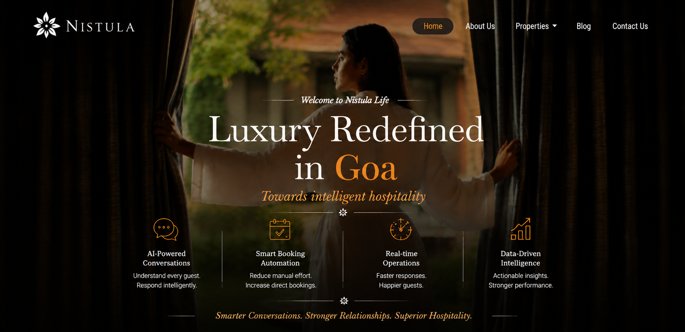

<p align="center">
  
</p>

<h1 align="center">
Nistula Guest Messaging System
</h1>

<p align="center">
AI-Assisted Hospitality Messaging Backend
</p>

# Nistula Guest Messaging Intelligence System

> An AI-powered hospitality backend that classifies guest intent, drafts contextual responses, and routes messages through intelligent escalation workflows.

Built for the Nistula.
---

## Tech Stack

| Layer | Technology |
|-------|------------|
| Runtime | Python 3.11 |
| Framework | FastAPI + Uvicorn |
| Validation | Pydantic |
| AI | Anthropic Claude (Sonnet 4) |
| Database | PostgreSQL |
| Docs | Swagger UI (`/docs`) |

---

## System Architecture

The backend follows a modular 9-stage service-oriented pipeline:

```
Guest Message
      │
      ▼
01. Webhook Ingestion       FastAPI receives message from WhatsApp / SMS / email
      │
      ▼
02. Payload Validation      Pydantic enforces type safety on request shape and source
      │
      ▼
03. Message Normalization   Unified internal format constructed regardless of channel
      │
      ▼
04. Rule-Based Classification   Intent mapped to query type
      │
      ▼
05. Dynamic Prompt Construction  Property context injected for grounded AI prompting
      │
      ▼
06. Claude AI Generation    Hospitality-tuned response drafted via Anthropic Claude
      │
      ▼
07. Confidence Scoring      Heuristic engine evaluates response quality and certainty
      │
      ▼
08. Operational Routing     Decision based on confidence threshold:
      │                       → auto_send
      │                       → agent_review
      │                       → escalate
      ▼
09. Structured JSON Response  message_id, query_type, drafted_reply, confidence_score, action
```

---

## Project Structure

```
nistula-technical-assessment/
├── app/
│   ├── routes/         # FastAPI endpoint definitions
│   ├── schemas/        # Pydantic request & response models
│   ├── services/       # Core business logic
│   ├── prompts/        # Dynamic prompt templates
│   ├── constants/      # Shared constants & enums
│   └── config/         # Environment & app configuration
├── tests/              # Test payloads and scenario coverage
├── schema.sql          # PostgreSQL relational schema
├── thinking.md         # Design rationale and decisions
├── requirements.txt
└── README.md
```

---

## Setup

### 1. Clone & Create Environment

```bash
git clone <repository_url>
cd nistula-technical-assessment
python -m venv venv
```

### 2. Activate Environment

```bash
# Windows
venv\Scripts\activate

# macOS / Linux
source venv/bin/activate
```

### 3. Install Dependencies

```bash
pip install -r requirements.txt
```

### 4. Configure Environment Variables

Create a `.env` file in the project root:

```env
ANTHROPIC_API_KEY=your_api_key_here
CLAUDE_MODEL=claude-sonnet-4-20250514
```

### 5. Run the Application

```bash
uvicorn app.main:app --reload
```

### 6. Open Swagger Docs

```
http://127.0.0.1:8000/docs
```

---

## API Reference

### `POST /message`

Process an incoming guest message and return a drafted response with routing action.

**Example Request:**

```json
{
  "source": "whatsapp",
  "guest_name": "Rahul Sharma",
  "message": "Is the villa available from April 20 to 24?",
  "timestamp": "2026-05-05T10:30:00Z",
  "booking_ref": "NIS-2024-0891",
  "property_id": "villa-b1"
}
```

**Example Response:**

```json
{
  "message_id": "51b3d682-2df4-43e8-ae07-e4be3d92b326",
  "query_type": "pre_sales_availability",
  "drafted_reply": "Thank you for your message. Our team will review your request and get back to you shortly.",
  "confidence_score": 0.95,
  "action": "auto_send"
}
```

### Routing Actions

| Action | Description |
|--------|-------------|
| `auto_send` | High confidence — reply sent directly to guest |
| `agent_review` | Moderate confidence — drafted reply queued for human review |
| `escalate` | Low confidence or complaint — routed to senior agent |

### Supported Query Types

- `pre_sales_availability`
- `pricing_enquiry`
- `post_sales_support`
- `special_request`
- `complaint`
- `ambiguous_multi_intent`

---

## Features

- **FastAPI webhook backend** with automatic Swagger documentation
- **Request & response validation** via Pydantic schemas
- **Rule-based intent classification** across 6 query categories
- **Dynamic AI prompt generation** with property context injection
- **Claude AI integration** for hospitality-tuned response drafting
- **Confidence scoring engine** with threshold-based operational routing
- **Three-tier escalation workflow** — auto_send → agent_review → escalate
- **Graceful fallback handling** — structured response returned even on AI provider failure
- **PostgreSQL relational schema** for guests, messages, properties, and audit trails
- **Swagger UI** for interactive API exploration and testing

---

## Error Handling

The system handles all operational edge cases gracefully. A structured JSON response is always returned — the service never crashes to a raw exception.

| Scenario | Behaviour |
|----------|-----------|
| Invalid payload | 422 Unprocessable Entity with field-level detail |
| Unsupported source channel | Rejected at validation with clear error message |
| Invalid property ID | Handled in service layer with structured fallback |
| AI provider failure | Fallback response returned; action set to `agent_review` |
| Operational exception | Caught and returned as structured error response |

---

## Test Scenarios

Sample payloads are included in `tests/` for the following scenarios:

- Availability enquiries
- Pricing requests
- Post-sales support queries
- Special requests
- Complaint escalation
- Ambiguous multi-intent queries
- Invalid payload validation

---

## Design Principles

This implementation intentionally prioritises:

- **Modular backend design** — each pipeline stage is independently testable and replaceable
- **Operational clarity** — routing decisions are transparent and explainable
- **Explainable AI logic** — confidence scoring is heuristic-based, not a black box
- **Maintainability** — service-oriented structure with clear separation of concerns
- **Realistic hospitality workflows** — query types and escalation paths reflect real-world operations

The system is appropriately scoped for the assessment while reflecting production-oriented engineering practices.

---

## References

The following resources were referenced for architecture patterns and implementation inspiration:

- [anthropic-fastapi-service](https://github.com/furkankyildirim/anthropic-fastapi-service)
- [chatbot-ai-system](https://github.com/cbratkovics/chatbot-ai-system)
- [HotelBot AI](https://github.com/aDataMage/hotelbot_ai)
- [UniChat Unified Messaging Hub](https://github.com/EngineerMubashir/unichat-unified-messaging-hub)
- [hookdeck webhook-skills](https://github.com/hookdeck/webhook-skills)

---

*Nistula Summer Technology Internship 2026 — Technical Assessment Submission*
